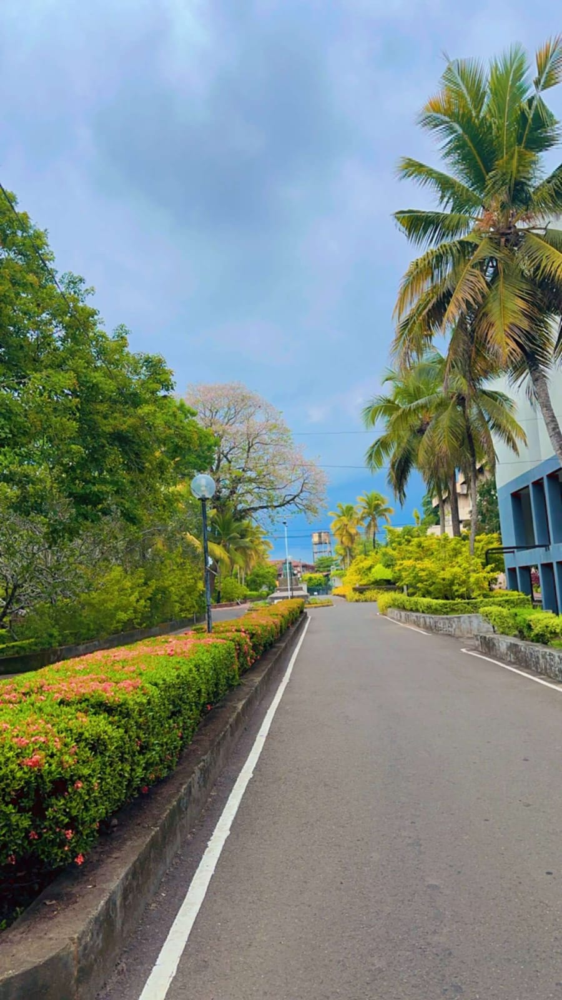

```{r setup, include=FALSE}
knitr::opts_chunk$set(echo = TRUE)
```

# Gestalt Principles in a Photograph

## Introduction

In this report, I will analyze a photograph using the Gestalt principles of visual perception. The goal is to show how these principles help us understand and organize visual information.

## Photograph

```{r, echo=FALSE, out.width="70%"}

```

## Explanation

### Proximity

The bushes in the left side of the photo, along the road are placed close together, making them look like they belong to the same group.Also the red colour flowers which are in the bushes show the proximity principle.

### Similarity

The plants in the photo share similar colours and shapes, especially the green bushes and the coconut trees in the right side of the photo, which our brain groups together due to their visual similarity.Even though the coconut trees are spread out in the photo, they are identical in shape and colour which is a good example for similarity.

### Enclosure

The road has clear edges (white lines), which makes it stand out from the plants and buildings. Also the surrounding greenery create a boundary for the path, making it enclosed.

### Closure

Although the path curves and disappears into the distance, our brains complete the missing parts,as it is a continuous walkway. 

### Connectedness

The white colour painted lines connect the elements of the road, helping us to see them as a merged path.

### Continuity

The lines of the path and the trees guide our eyes through the photo, suggesting a continuous route.

### Figure and Ground

The blue sky serves as a simple background that helps to highlight the trees and pathway in the foreground.

## Conclusion

This photograph uses several Gestalt principles to create a clear and organized image. These principles help our brains make sense of what we see, grouping similar items and following lines and edges to understand the scene.

